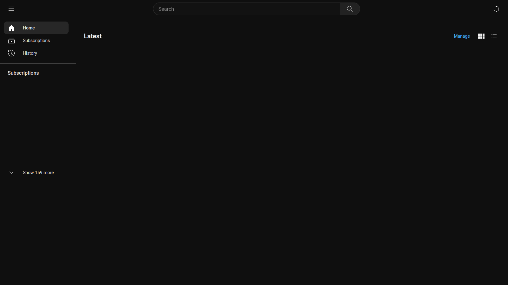
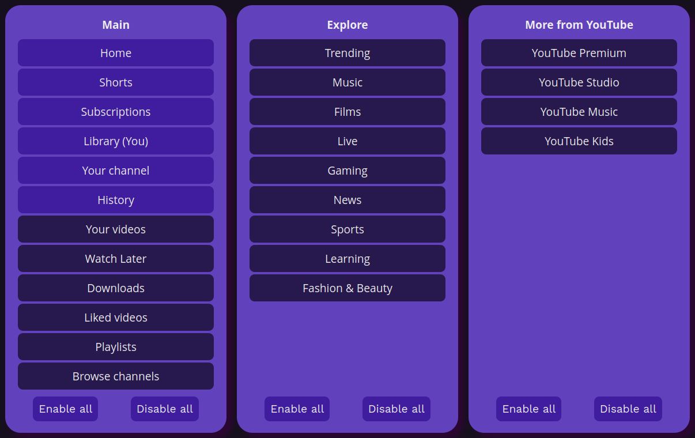

<div align="center">


# YouTube Customizer

Web browser extension for customizing YouTube

</div>

<div align="center">
    <a href="https://addons.mozilla.org/addon/youtubecustomizer"></a>
    <a href="https://addons.mozilla.org/addon/youtubecustomizer"></a>
    <a href="https://img.shields.io/github/issues/ryze312/youtube-customizer/issues"></a>
    <a href="https://opensource.org/license/gpl-3-0"></a>
</div>




## Features
- Toggling various elements of layout (e.g sidebar buttons)
- Redirecting home page to subscriptions
- [ff2mpv](https://github.com/woodruffw/ff2mpv) integration

## Usage
<a href="https://addons.mozilla.org/addon/youtubecustomizer"></a>

*Chromium-based browsers are not supported*

## Configuration
The extension provides configuration using settings page that can be accessed through web browser extension page.



## Supported languages
The extension has localization for the following languages:
- English
- Spanish
- French
- Hungarian
- Russian

## Building
YouTube Customizer uses [pnpm](https://github.com/pnpm/pnpm) and [web-ext](https://github.com/mozilla/web-ext) for building and bundling final package, as well as [TypeScript transpiler](https://github.com/microsoft/TypeScript) for building JavaScript sources.

1. Install TypeScript, pnpm and web-ext using system package manager or npm
```
npm install -g typescript web-ext pnpm 
```

2. Install dependencies and run build
```
pnpm install
pnpm build
```

# Contributing
All issues and pull requests are welcome! Feel free to open an issue if you've got an idea or a problem. You can open a pull request if you are able to implement it yourself.

---
<p align="center">
<sub><strong>
    Made with ponies and love!
    <br/>
    GNU GPL © Ryze 2023 💜
</strong></sub>
</p>
